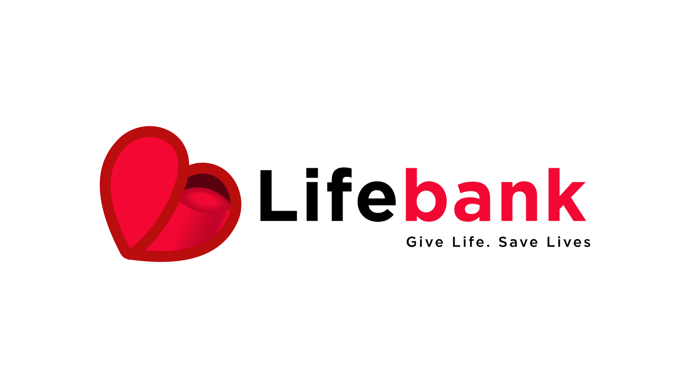
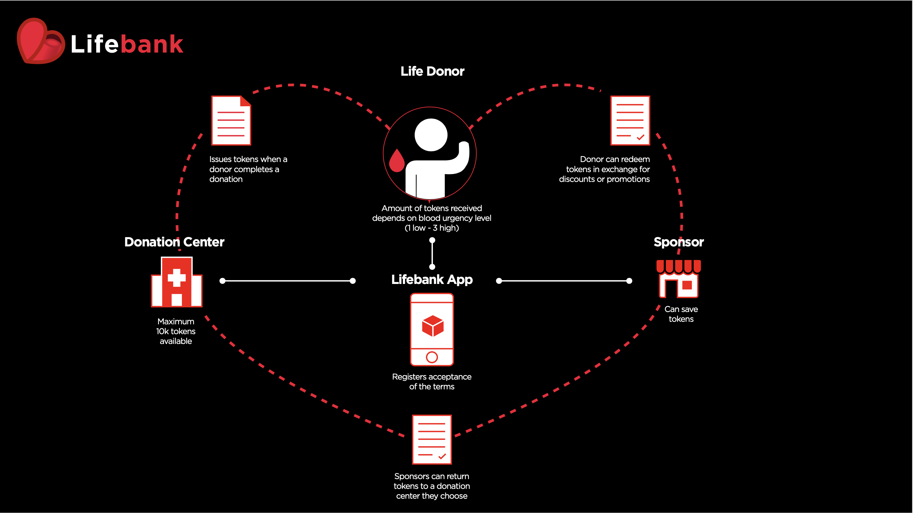
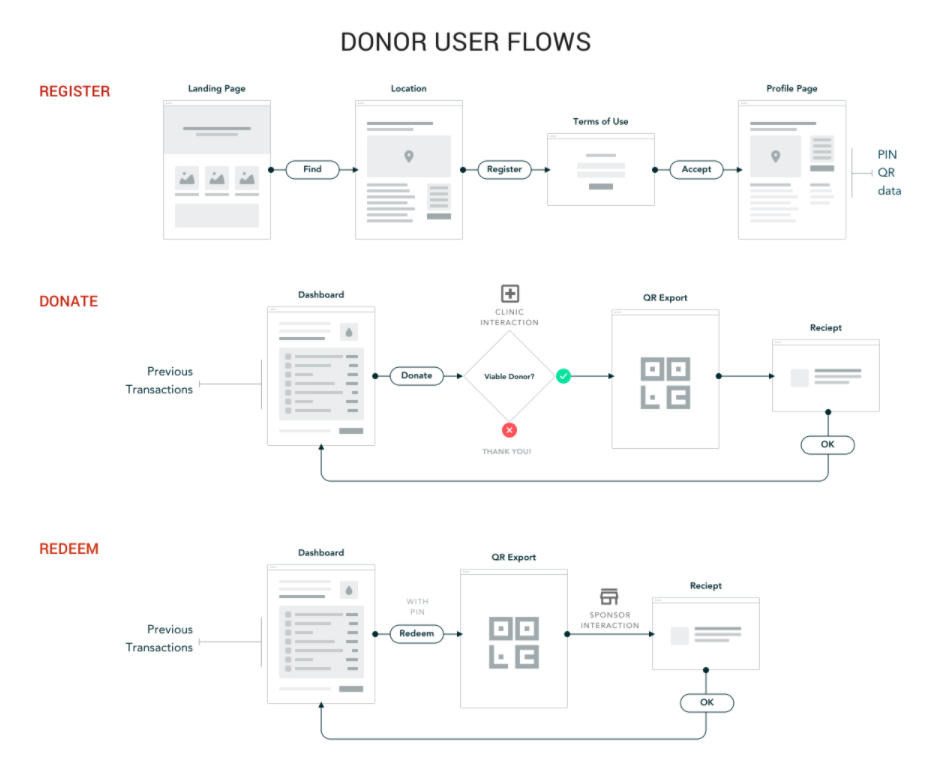
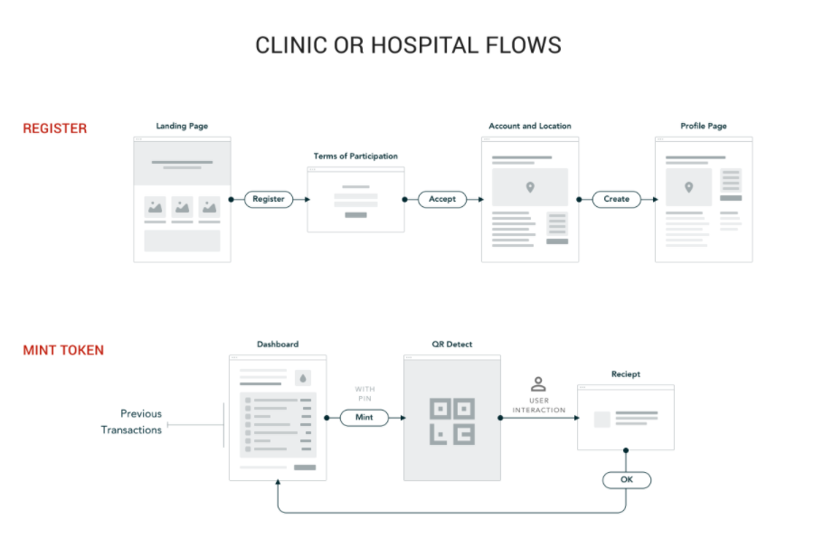
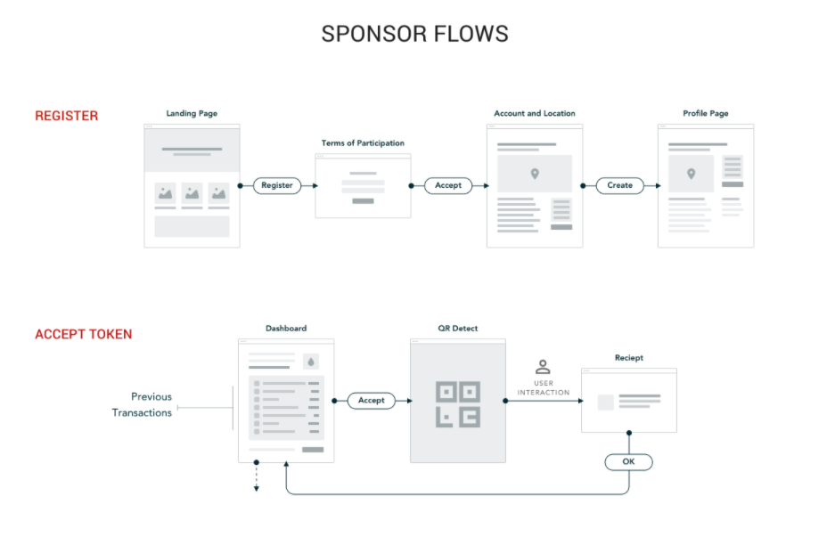
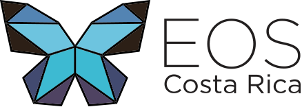

<p align="center">
	
<br/>
<a href="http://standardjs.com">

</a>
<a href="http://standardjs.com">

</a>
<a href="https://git.io/col">

</a>
<a href="#">

</a>
<a href="https://twitter.com/intent/follow?screen_name=eoscostarica">

</a>
</p>

# Lifebank.io

**EOSIO VIRTUAL HACKATHON [Coding for Change - May 2020](https://hackathon.eos.io/events/coding-for-change/)**

**Table of Contents**

- [Inspiration](#inspiration)
- [What is LifeBank?](#what-is-lifebank)
- [User Experience](#user-experience)
- [Sign Up](#sign-up)
- [How we built it?](#how-we-built-it)
- [How we use EOSIO Blockchain Technology](#how-we-use-EOSIO-blockchain-technology)
- [Hackathon Experience](#hackathon-experience)
- [What's next for Lifebank.io](#whats-next-for-lifebankio)
- [Contributing](#contributing)
- [About EOS Costa Rica](#about-eos-costa-rica)
- [License](#license)
- [Contributors](#contributors)

## Inspiration

Blood banks should act just as their name reflects. When we are healthy, we should be able to save for the future by making deposits. When we inevitably get sick, we should be able to withdrawal on those savings to pay for expenses related to our condition.

When our team member's father was diagnosed with cancer, he had to undergo treatment and consequently receive a blood transfusion. He needed blood to survive. As he recovered, he only asked his family one simple request: to help him pay his new lease on life and payback the blood he received on loan. So, he asked his family to donate blood proactively.

Then, our teammate understood why he needed to donate blood and how important it was to his father's life. What he didn't understand is why he waited this long to do so. He thought he should have been donating blood all those years prior when he was healthy and eligible, knowing that one day in the future a relative or himself would need it. He should have been making deposits in the blood bank so that he could withdraw those savings now when he needed it. Now he needed to pay back a loan on life in the same way his father received it, by a blood donation.

Fast forward to 2020, COVID-19 spreads to a global pandemic and national emergencies are declared in countless countries around the world. Social distancing and quarantines cause blood shortages globally as donations plummet while demand for blood and plasma increases. Blood banks enter a short term shortage all over the world with no lifeline in sight.

- ['On the precipice': COVID-19 has Canadian Blood Services worried about shortage](https://www.theglobeandmail.com/canada/article-on-the-precipice-covid-19-has-canadian-blood-services-worried-about/)

- [It's more important than ever to donate blood](https://qz.com/1857865/why-hospitals-fear-a-critical-blood-shortage-as-the-us-reopens/)

- [How COVID-19 led to a blood shortage, and why that's troubling](https://whyy.org/articles/how-covid-19-led-to-a-blood-shortage-and-why-thats-troubling/)

- [COVID-19 battle takes toll on New York City blood supply: Mayor](https://abcnews.go.com/US/covid-19-battle-takes-toll-york-city-blood/story?id=70731542)

- [NYC wants YOU to donate blood: Mayor de Blasio](https://www.nydailynews.com/coronavirus/ny-coronavirus-blood-donations-bill-de-blasio-20200517-dgo5m6jfmbbdzexolaqcapfxpi-story.html)

- [Por coronavirus, donación de sangre disminuyó 60%: IMSS](https://www.infobae.com/america/mexico/2020/05/17/por-coronavirus-donacion-de-sangre-disminuyo-60-imss/)

- [Banco de Sangre apela al espíritu solidario de la población para mantener reservas](https://www.elmundo.cr/costa-rica/banco-de-sangre-apela-al-espiritu-solidario-de-la-poblacion-para-mantener-reservas/)

- [Los bancos de sangre tienen hasta 50% menos de la cifra óptima para la autosuficiencia](https://www.telam.com.ar/notas/202005/464193-bancos-de-sangre-donacion-faltante.html)

Donations centers across the globe need a way to encourage blood donations based on local demand during a time of crisis. As the demand for blood increases during the crisis, the eligible donor population was told to stay home, isolate, and avoid medical facilities causing a deepened shortage.

- [Blood banks drying up](https://www.dhakatribune.com/bangladesh/dhaka/2020/05/18/blood-banks-drying-up)

- [Market For Blood Plasma From COVID-19 Survivors Heats Up](https://www.npr.org/sections/health-shots/2020/05/11/852354920/market-for-blood-plasma-from-covid-19-survivors-heats-up)

- [Local notes: Blood donors urgently needed](https://www.arkansasonline.com/news/2020/may/17/local-notes-blood-donors-urgently-neede/)

- [Blood shortage common in Ramadan, but COVID-19 makes matters worse: PMI](https://www.thejakartapost.com/news/2020/05/14/blood-shortage-common-in-ramadan-but-covid-19-makes-matters-worse-pmi.html)

- [American Red Cross urging students to donate blood - Loquitur](https://www.theloquitur.com/american-red-cross-urging-students-to-donate-blood/)

- [How plasma from recovered coronavirus patients could help others survive the disease](https://thehill.com/changing-america/well-being/prevention-cures/493690-how-plasma-from-recovered-coronavirus-patients)

Another consequence of the pandemic was the economic devastation of a lockdown. Small businesses that rely on the local community for a majority of their business have to think of ways to incentivize customers to buy online or in-person as soon as restrictions are lifted. Small businesses also need a lifeline.

- [Impact of Coronavirus on Small Businesses - Where Is It Worst?](https://smallbiztrends.com/2020/04/impact-of-coronavirus-on-small-businesses.html)

- [Stanislaus County businesses among those struggling to pay rent during coronavirus](https://www.modbee.com/news/local/article242714171.html)

- [Will Small Tour Operators Survive The Economic Impact Of COVID-19?](https://www.forbes.com/sites/irenelevine/2020/04/28/will-small-tour-operators-survive-the-economic-impact-of-covid-19/)

- [COVID-19 impact ripples through local economy](http://www.fortmyersbeachtalk.com/page/content.detail/id/637336/COVID-19-impact-ripples-through-local-economy.html?nav=5064)

- [How COVID-19 is affecting small businesses in D.C. - D.C. Policy Center](https://www.dcpolicycenter.org/publications/small-businesses-coronavirus/)

During the current COVID-19 health crisis and others in the future, we aim to build a tool that:

- Provides value and recognition to blood donors that are eligible to donate when healthy.
- Mitigates the blood shortage that exists in perpetuity and that are exasperated during a crisis.
- Supports local businesses and have them encourage blood donation in their community.

To align the relevant incentives and accomplish the above, we created **Lifebank.**

## **What is Lifebank?**

Lifebank helps local communities create a virtuous circle of value exchange between three parties — an **eligible donor, a donation center and a sponsor.**

[](./docs/lifebankflow.png)

### Watch the Video

[](http://www.youtube.com/watch?v=tgbZWs5vE5s "LifeBank - EOSIO Virtual Hackathon Project")

**Glossary:**

- Potential Life Donor - anyone who could possibly donate blood to a local donation center
- Qualified Blood Donation - A blood donation to a participating donation center
- Lifebank - Any community donation center that accepts blood donations
- Life Token - A donation token receipt given to a eligible donor after a qualified blood donation
- Eligible Life Donor - a registered blood donor deemed eligible to donate by a participating donation center
- Sponsor - A participating local business or community organization that agreed to return some predetermined value to a life donor in exchange for a life token
- Value - economic or community value that sponsors communicate to life donors in order to incentivize the redemption of Life Tokens

## User Experience

### Donor User Flow

[](./docs/donor-user-flow.png)
**[See UX Design Assets on Zeplin](https://zpl.io/a8o9A7X)**

**1) Find a Lifebank and Register**

Using Lifebank.io, a potential life donor can find a community donation center in their area based on their location. The user will be able to see on a map where the centers are located and also if they have a high demand for blood. Once the user sees that there is a demand for their type of blood in close proximity, they can review the ricardian contracts, sign the contract to register for an account, and visit the donation center location.

**2) Donate and Receive a Life Token**

Once the potential life donor visits the community donation center, they will need to complete the eligibility criteria for the specific donation. This will be handled as usual in person at the donation center before a blood donation. The donation center will also be able to post pre-requisites on their profile page so the potential donor can decide if they meet the criteria before visiting.

If the potential donor is deemed eligible by the donation center, they can proceed with the blood donation and are referred to as eligible life donor. Once completed, the donation center can certify the completion by minting a **life token** valid in their specific community. The donor will receive the life token from the donation center to the QR code displayed through the application. Once a life token is received in a donor's account, the life token becomes redeemable with a sponsor.

| Blood Urgency Level | Tokens Issued |
| ------------------- | ------------- |
| 1 - Low             | 1             |
| 2 - Medium          | 2             |
| 3 - High            | 3             |

**Note:** A limit of 10,000 LIFE tokes has been placed on the amount of life tokens for each community.

**3) Redeeming a life token with a sponsor**

An eligible life donor can redeem their life token with a sponsor. The user can log into the Lifebank app to find the sponsor's general information, opening hours, and what they offer in exchange for a life token. Once they decide on a sponsor where they would like to redeem the life token, they can go to the physical location or visit their website if the business is an e-commerce enabled business. At checkout, the eligible donor will be prompted to transfer the life token to the sponsor to redeem the offer. Once the transfer is complete, the sponsor provides the offer to the donor, and the life token transfers to the sponsor's account. Once a donation token receipt is received into a sponsor account, the life token is only transferable to other lifebank accounts.

### Lifebank User Flow

[](./docs/clinic-user-flow.png)
**[See Donation Center User Flow on Zeplin](https://zpl.io/amAMKdQ)**

1. **Register as a Lifebank**

A donation center, defined in the terms of participation as a center that is regulated and licensed to receive blood donations, can register as a Lifebank using the Lifebank application. The donation center user will be directed from the landing page to register as a Lifebank using their credentials. The donation center user will then need to review and sign the terms of participation in order to create an account and testify that they meet the criteria. Once an account is created, the donation center user may display all the information relevant to receiving donations like location, opening hours, eligibility criteria, etc on their Lifebank profile. The donation center must indicate the amount of donation token receipts they are currently willing to issue per donation.

**2) Verifying a Eligible Life Donor and receiving a qualified blood donation**

Once a potential life donor visits a Lifebank, they must first pass the qualifying requirements set by each donation center. This is usually done by a simple questionnaire about the person and medical history. No information related to the donor will be provided to the Lifebank app. If the potential life donor is qualified to donate, they can proceed with a qualified blood donation (QBD) as defined in the terms of participation signed by the donation center. The potential donor user will now be eligible to receive a life token and be referred to as an eligible life donor.

3. **Issuing a Life Token and transferring to a Eligible Life Donor**

Once a eligible life donor completes a qualified blood donation, the Lifebank will acknowledge the event by issuing a Life Token. The eligible life donor will present a QR code representing their Lifebank account and the donation center will transfer the Life Token by scanning the QR code. If the Life token has an expiry date, the transfer from the Lifebank to the eligible life donor will mark the beginning of the term.

### Sponsor User Flow

[](./docs/sponsor-user-flow.png)

**[Sponsor User Flow on Zeplin](https://zpl.io/a8o9kq6)**

**1) Register as a Sponsor**

A local business or organization can register to become a sponsor on the Lifebank application. The user will be prompted from a landing page to review and accept the terms of participation. Once accepted, the user will be able to create a profile to enter general information, location, hours of operation, products, services and offer a value proposition in exchange for a life token.

**2) Accessing the dashboard**

Once a participating business has completed the registration process, they will be able to access the Lifebank dashboard. The dashboard will show the balance of life token received over time, their current value proposition offer and a toggle to redeem life tokens. If a eligible life donor wishes to redeem a life token, the sponsor would access the redeem option on the dashboard.

**3) Accepting a Life Token**

A registered sponsor can accept life tokens from any eligible life donor that wishes to buy goods or services as defined in the terms of participation. When a eligible life donor makes a qualifying purchase as displayed on the sponsor's Lifebank profile, the eligible donor can redeem a life token in exchange for the value proposition as specified by the sponsor. To redeem a life token, the sponsor must show their sponsor account QR code as displayed on the application to the eligible life donor wishing the make a purchase. The donor will scan the QR code and transfer the life token from their account to the sponsor account. Once received in the sponsor account, the community donation token receipt is considered redeemed and is non-transferable. If the life token has an expiry date, the transfer from the eligible donor to the participating business will mark the end of the term. The end of the term must come before the expiry date.

## Sign Up

Users sign up on the register page.

The register page creates a blockchain account and should help handle key management, all the users need to remember is a an account name and password.

## How we built it?

Lifebank uses the following technology to create a virtuous circle of value exchange between the three parties — a **donor user, a donation center and a sponsor.**

### How to run Lifebank locally

```bash
git clone git@github.com:eoscostarica/lifebank.git
cd lifebank
cp .env.example .env
make install
make run
```

### App Services

We use **Docker** for all app services

- **[Smart Contracts](./contracts):** EOSIO smart contracts are built from  **C++** code and **Ricardian Contracts**
- **[webapp](./frontend)::** A **React JS** Web Client based that leverages **Material UI**.
- **[hasura](./hasura):** An autogenerated **GraphQL** API based on the **PostgresDB**.
- **[hapi](./hapi)::** A **NodeJS** back end service for account management, wallet service integration and synchronizing blockchain tables with postgreSQL.
- **[wallet](./wallet)::** A **keosd** service is running to store all private keys securely and sign transactions.
- **nginx:** Nginx is a web server which is also used as a reverse proxy to route external traffic to the appropriate services.
  **EOSIO Node:** [https://jungle.eosio.cr](https://jungle.eosio.cr/)

_Note: This project is based on our [EOS DApp Boilerplate](https://github.com/eoscostarica/webapp-boilerplate)._

### Test Environment

We are testing this application on the [Jungle TestNet](https://jungletestnet.io).  
This UI is currently available at https://lifebank.io  
We are running webapp and backend services on our own servers on premises in Costa Rica.

## How we use EOSIO Blockchain Technology

The App creates EOS accounts for every new user, lifebank manage keys in our own wallet (we plan on making a key pair just for lifebank and giving the users their active or owner keys as accounts that have been validated as human once they donate blood)

### Informed Consent Contract [`consent2life`](https://jungle3.bloks.io/account/consent2life?loadContract=true&tab=Tables&account=consent2life&scope=consent2life&limit=100)

- manages informed consent onchain from any account to any smart contract for a specific version of the contract (hash derived from ABI)
- accounts can revoke consent
- on chain Ricardian contracts are rendered in app for user to review before consent

### Community Contract [`lifebankcode`](https://jungle3.bloks.io/account/lifebankcode?loadContract=true&tab=Tables&account=lifebankcode&scope=lifebankcode&limit=100)

- checks for on-chain informed consent
- manages community membership (donors and sponsors)
- manages blood demand level of lifebanks to set rate of token issuance
- users can delete their records from RAM
- on chain Ricardian contracts are rendered in app for user

### Community Token Contract [`lifebankcoin`](https://jungle3.bloks.io/account/lifebankcoin?loadContract=true&tab=Tables&account=lifebankcoin&scope=lifebankcoin&limit=100)

- checks for on-chain informed consent
- manages issuance of LIFE tokens (only lifebanks can issue based on blood demand level)
- manages token transfer flow (lifebank -> donor -> sponsor -> lifebank)
- on chain Ricardian contracts are rendered in app for user

## Hackathon Experience

### Challenges we ran into

- Defining the scope of the project to make sure it was not to broad
- How to setup a ACL that helps the user sign up experience while handling key management
- Preventing abuse as well as extortion of users for donations
- Preventing over issuance from community donation centers due to abuse or corruption
- Whether to allow a secondary market on the donation receipt tokens
- Preventing spam account creation (some ideas: invite links/ ram quota / clinic only signup )

### Accomplishments that we've proud of

- Team dynamics and extra effort
- Use of top-notch technologies
- Balance of design complexity / time limitations

### What we learned

- Learned more about creating a custom token contract with unique governance rules.
- Learned more about creating a custom token contract with unique governance rules.

## What's next for Lifebank.io

Lifebank takes a on a life of its own!

### For future releases:

- Set expiry options to a given token
- Introduce LifeBank demand for blood types
- Allow sponsors to sell life tokens to local charities at an set price.
- Track financial donations and issue certain life tokens for those donations.
- The tracked donation funds would represent the financial demand for life tokens while the outstanding life tokens in the community would represent the supply.
- Set a pricing algorithm like Bancor to provide a fair market price where sponsors can sell their life tokens in savings to local charities (Red Cross Fund, philanthropists, private donors, etc)

## Contributing

We use a Kanban-style board. That's were we prioritize the work. [Go to Project Board](https://github.com/eoscostarica/lifebank/projects/1).

Contributing Guidelines https://developers.eoscostarica.io/docs/open-source-guidelines.

Please report bugs big and small by [opening an issue](https://github.com/eoscostarica/lifebank/issues)

## About EOS Costa Rica

<p align="center">
<a href="https://eoscostarica.io">

</a>
</p>
<br/>

EOS Costa Rica is an independently-owned, self-funded, bare-metal Genesis block producer that provides stable and secure infrastructure for EOSIO blockchains. We support open source software for our community while offering enterprise solutions and custom smart contract development for our clients.

[eoscostarica.io](https://eoscostarica.io)

## License

MIT © [EOS Costa Rica](https://eoscostarica.io)

## Contributors

Thanks goes to these wonderful people ([emoji key](https://github.com/kentcdodds/all-contributors#emoji-key)):

<!-- ALL-CONTRIBUTORS-LIST:START - Do not remove or modify this section -->
<!-- prettier-ignore-start -->
<!-- markdownlint-disable -->
<table>
<tr>

<td align="center"><a href="https://github.com/murillojorge"><br /><sub><b>Jorge Murillo</b></sub></a><br /><a href="#ideas-murillojorge" title="Ideas, Planning, & Feedback">🤔</a> <a href="https://github.com/eoscostarica/lifebank/commits?author=murillojorge" title="Documentation">📖</a> <a href="#design-murillojorge" title="Design">🎨</a>  <a href="#review-murillojorge" title="Reviewed Pull Requests">👀</a></td>

<td align="center"><a href="https://github.com/adriexnet"><br /><sub><b>Adriel Díaz</b></sub></a><br /> <a href="https://github.com/eoscostarica/lifebank/commits?author=adriexnet" title="Code">💻</a> <a href="#review-adriexnet" title="Reviewed Pull Requests">👀</a></td>

<td align="center"><a href="https://github.com/xavier506"><br /><sub><b>Xavier Fernandez</b></sub></a><br /><a href="#ideas-xavier506" title="Ideas, Planning, & Feedback">🤔</a><a href="https://github.com/eoscostarica/lifebank/commits?author=xavier506" title="Code">💻</a><a href="#projectManagement-xavier506" title="Project Management">📆</a> <a href="#infra-xavier506" title="Infrastructure (Hosting, Build-Tools, etc)">🚇</a></td>

<td align="center"><a href="http://www.eoscostarica.io"><br /><sub><b>Edgar Fernandez</b></sub></a><br /><a href="#ideas-edgar-eoscostarica" title="Ideas, Planning, & Feedback">🤔</a> <a href="#blog-edgar-eoscostarica" title="Blogposts">📝</a><a href="https://github.com/eoscostarica/lifebank/commits?author=edgar-eoscostarica" title="Documentation">📖</a> <a href="#talk-edgar-eoscostarica" title="Talks">📢</a></td>

<td align="center"><a href="https://github.com/kecoco16"><br /><sub><b>kecoco16</b></sub></a><br /><a href="#ideas-kecoco16" title="Ideas, Planning, & Feedback">🤔</a><a href="https://github.com/eoscostarica/eoscr-theme/commits?author=kecoco16" title="Code">💻</a><a href="#review-kecoco16" title="Reviewed Pull Requests">👀</a></td>

</tr>
<tr>
<td align="center"><a href="https://github.com/rubenabix"><br /><sub><b>Rubén Abarca Navarro</b></sub></a><br /><a href="#ideas-rubenabix" title="Ideas, Planning, & Feedback">🤔</a> <a href="https://github.com/eoscostarica/lifebank/commits?author=rubenabix" title="Code">💻</a> <a href="#review-rubenabix" title="Reviewed Pull Requests">👀</a></td>

<td align="center"><a href="https://github.com/roafroaf"><br /><sub><b>Rodolfo Perëz</b></sub></a><br /><a href="#ideas-roafroaf" title="Ideas, Planning, & Feedback">🤔</a> <a href="#design-roafroaf" title="Design">🎨</a></td>

<td align="center"><a href="https://github.com/ldrojas">
<br /><sub><b>Luis Diego Rojas</b></sub></a><br /><a href="https://github.com/eoscostarica/lifebank/commits?author=ldrojas" title="Ideas, Planning, & Feedback">🤔</a><a href="#blog-ldrojas" title="Blogposts">📝</a></td>

<td align="center"><a href="https://github.com/tetogomez">
<br /><sub><b>Teto Gomez</b></sub></a><br /><a href="https://github.com/eoscostarica/lifebank/commits?author=tetogomez" title="Ideas, Planning, & Feedback">🤔</a> <a href="https://github.com/eoscostarica/lifebank/commits?author=tetogomez" title="Code">💻</a> <a href="#review-tetogomez" title="Reviewed Pull Requests">👀</a></td>

<td align="center"><a href="https://github.com/Kriskoin"><br /><sub><b>KrisKoin</b></sub></a><br /><a href="https://github.com/eoscostarica/lifebank/commits?author=Kriskoin" title="Code">💻</a> <a href="#review-Kriskoin" title="Reviewed Pull Requests">👀</a></td>
</tr>
</table>

<!-- markdownlint-enable -->

<!-- prettier-ignore-end -->

<!-- ALL-CONTRIBUTORS-LIST:END -->

This project follows the [all-contributors](https://github.com/kentcdodds/all-contributors) specification. Contributions of any kind welcome!
