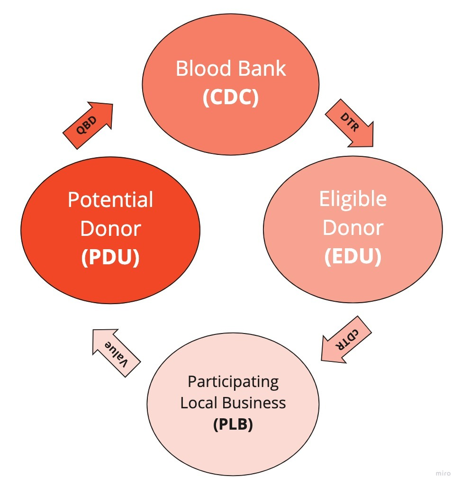

# Lifebank.io
**EOSIO VIRTUAL HACKATHON [Coding for Change - May 2020](https://hackathon.eos.io/events/coding-for-change/)**

**Table of Contents**  

  - [Inspiration](#inspiration)
  - [What is Lifebank?](#what-is-lifebank)
  - [Sign Up](#sign-up)
  - [How we built it?](#how-we-built-it)
  - [Hackathon Experience](#hackathon-experience)
  - [What's next for Lifebank.io](#whats-next-for-lifebankio)
  - [Contributing](#contributing)
  - [About EOS Costa Rica](#about-eos-costa-rica)
  - [License](#license)
  - [Contributors](#contributors)

## Inspiration

Blood banks should act just as their name reflects.  When we are healthy, we should be able to save for the future by making deposits. When we inevitably get sick, we should be able to withdrawal on those savings to pay for expenses related to our condition.   

When our team member's father was diagnosed with cancer, he had to undergo treatment and consequently receive a blood transfusion. He needed blood to survive.  As he recovered, he only asked his family one simple request. Help him pay his new lease on life. Pay back the blood he received on loan. He asked that the family donate blood. 

Our team member understood why he needed to donate blood and how important it was to his father's life.  What he didn't understand is why he waited this long to do so.  He thought he should have been donating blood all those years prior when he was healthy and eligible, knowing that one day in the future a relative or himself would need it.  He should have been making deposits in the blood bank so that he could withdraw those savings now when he needed it. Now he needed to pay back a loan on life in the same way his father received it, by a blood donation. 

Fast forward to 2020, COVID-19 spreads to a global pandemic and national emergencies are declared in countless countries around the world.  Social distancing and quarantines cause blood shortages globally as donations plummet while demand for blood and plasma increases. Blood banks enter a short term shortage all over the world with no lifeline in sight. 

`[insert links to news around shortages of blood around the world]`

Donations centers across the globe need a way to encourage blood donations based on local demand during a time of crisis. As the demand for blood increases during the crisis,  the eligible donor population were told to stay home, isolate and avoid medical facilities causing a deepened shortage. 

`[insert links of stories around avoiding hospitals, clinics, etc]`

Another consequence of the pandemic was the economic devastation of a lock-down.  Small businesses that rely on the local community for a majority of their business have to think of ways to incentivize customers to buy online or in person as soon as restrictions are lifted.  Small business also need a lifeline. 

`[insert links of stories around small business and the impact in local communities]`

**During the current COVID-19 health crisis and others in the future,  how can we:**

- **Provide value and recognition to blood donors that are eligible to donate when healthy?**
- **Mitigate the blood shortage that exists in perpetuity and that are exasperated during a crisis?**
- **Support local businesses and have them encourage blood donation in their community?**

To align the relevant incentives and accomplish the above, we created **Lifebank.io**   

## What is Lifebank?

Lifebank helps local communities create a virtuous circle of value exchange between three parties — a **eligible donor user (EDU), a community donation center (CDC) and a participating local business (PLB).** 

	

**Legend:**

- **PDU** -  potential donor user
- **QBD** -  qualified blood donation
- **CDC** - community donation center
- **DTR** - donation token receipt
- **cDTR** - community donation token receipt
- **EDU** - eligible donor user
- **PLB** - participating local business
- **Value** - perceived value that PLBs communicate to PDUs

### Eligible Donor User (EDU) Flow

**[Donor User Flow on Zeplin](https://zpl.io/a8o9A7X)**

- Potential Donor User (PDU)
- Eligible Donor User (EDU)

**1) Find a Community Donation Center and Register**

Using Lifebank.io, a potential donor user (PDU) can find a community donation center (CDC) in their area based on their location.  The user will be able to see on a map where the centers are located and also if they have a high demand for a certain blood type.  Once the user sees that there is a demand for their type of blood in close proximity, they can review the terms of use, sign the contract to register for an account and visit the CDC location. 

**2) Donate and receive a Donation Receipt Token (DRT)**

Once the potential donor user (PDU) visits the community donation center (CDC), they will need to complete the eligibility criteria for the specific donation. This will be handled as usual in person at the CDC before a blood donation. The donation center will also be able to post pre-requisites on their profile page so the potential donor can decide if they meet the criteria before visiting.  

If the potential donor is deemed eligible by the CDC, they can proceed with the blood donation and are referred to as eligible donor users (EDU). Once completed, the CDC can certify the completion by minting a donation token receipt (DTR) that is valid in their specific community (cDTR). The EDU will receive the DTR from the CDC to the QR code displayed through the application.  Once a DTR is received in a EDU's account,  the DTR becomes a cDTR and redeemable at PLBs.  

**Note:**  A limit cap may be placed on the amount of cDTR each community can have outstanding per time period to prevent abuse. As cDTRs are redeemed or expire, the CDC can continue to issue new cDTRs. Every registered member of that community may need to approve a cap increase.

**3) Redeeming a cDTR from a participating local business (PLB)**

An eligible donor user (EDU) can redeem their community donation token receipt (cDTR) at a participating local business (PLB).  The user can log into the Lifebank app to find PLB's general information, opening hours and what they offer in exchange for a cDTR.   Once they decide on a PLB where they would like to redeem the cDTR, they can go to the store's location or visit their website if the PBL is an e-commerce enabled business.  At checkout,  the eligible donor will be prompted to transfer the cDTR to the PLB's account to redeem the offer.  Once the transfer is complete, the PLB applies the offer to the order and the cDTR transfers to the PLBs account.  Once a cDTR is received into a PLBs account, the cDTR becomes a DTR and in no longer redeemable.  

**Note:**  A cDTR may expire after a certain time frame established by the issuing community donation center (CDC) to incentivize its use during the time of the crisis.  After a cDTR expires,  it can no longer be transferred and therefore is no longer redeemable at PLBs.  The cDTR converts to a DTR in the donor account to recognize the donation albeit without the redeemable value in the local community. 

### Community Donation Center (CDC) User Flow

**[Donation Center User Flow on Zeplin](https://zpl.io/amAMKdQ)**

- Community Donation Center (CDC)

**1) Register as a community donation center (CDC) and create a ticker**

A community donation center (CDC) , defined in the terms of participation as a center that is regulated and licensed to receive blood donations , can register as a CDC using the Lifebank application. The CDC user will be directed from the landing page to register as a CDC using their credentials. The CDC user will then need to review and sign the terms of participation in order to create an account and testify that they meet the criteria. Once an account is created, the CDC user may display all the information relevant to receiving donations like location, opening hours, eligibility criteria, etc on their Lifebank profile. The center may also provide current inventory information by blood type and indicate the current demand level. The CDC must indicate the amount of DTRs they are currently willing to issue per donation. The CDC may also name a 3-letter ticker by which their cDTR will be referred to in their community.  For example, a local CDC in Athens, Georgia may choose to call their cDTR "ATH" as long as the ticker combination is available.  

**2) Verifying a Eligible Donor User (EDU) and receiving a qualified blood donation (QBD)** 

Once a potential donor user (PDU) visits a community donation center (CDC),  they must first pass the qualifying requirements set by each CDC.  This is usually done by a simple questionnaire about the person and medical history.  No information related to the PDU will be provided to Lifebank.  The CDC representative only needs to indicate from the Lifebank dashboard if the person's account is qualified or not qualified to donate.  If the PDU is qualified to donate, they can proceed with a qualified blood donation (QBD) as defined in the terms of participation signed by the CDC.  The PBU will now be eligible to receive a cDTC and be referred to as an eligible donor user (EDU).  

**3) Issuing a Community Donation Token Receipt (cDTR) and transferring to a Eligible Donor User (EDU)**

Once a eligible donor user (EDU) completes a qualified blood donation (QBD), the community donation center (CDC) will acknowledge the event by issuing a community donation token receipt (cDTR). The EDU will present a QR code representing their Lifeline account and the CDC will transfer the cDTR by scanning the QR code.  If the cDTR has an expiry date,  the transfer from the CDC to the EDU will mark the beginning of the term.  

### Participating Local Business (PLB) User Flow

**[Sponsor User Flow on Zeplin](https://zpl.io/a8o9kq6)**
- Participating Local Business (PLB)

**1) Register as a Participating Local Business (PLB)**

A local business can register to become a participating local business (PLB) on the Lifebank application.  The user will be prompted from a landing page to review and accept the terms of participation.  Once accepted, the user will be able to create a profile to enter general information, location, hours of operation, products, services and offer a value proposition in exchange for a community donation token receipt (cDTR).  

**2) Accessing the dashboard**

Once a PLB has a completed the registration process, they will be able to access the Lifebank dashboard. The dashboard will show the balance of DTRs received over time, their current value proposition offer and a toggle to redeem cDTRs.  If a EDU wishes to redeem a cDTR, the PBL would access the redeem option on the dashboard. 

**3) Accepting a community donation token receipt (cDTR)**

A registered participating local business (PLB) can accept community donation token receipts (cDTR) from any eligible donor user (EDU) that wishes to buy goods or services as defined in the terms of participation.  When a EDU makes a qualifying purchase as displayed on the PBLs Lifebank profile, the EDU can redeem a cDTR in exchange for the value proposition as specified by the PLB.   To redeem a cDTR,  the PBL user must show their business account QR code as displayed on the application to the EDU wishing the make a purchase.  The EDU will scan the QR code and transfer the cDTR from their account to the PBL.  Once received in the PBL account, the cDTR is considered redeemed and is referred to as simply a Donation Token Receipt (DTR) which is non-transferable. If the cDTR has an expiry date,  the transfer from the EDU to the PLB will mark the end of the term.  The end of the term must come before the expiry date.  

## Sign Up

Users sign up on the register page.

The register page creates a blockchain account and should help handle key management, all the users need to remember is a an account name and password.

## How we built it?

Lifebank uses the following technology to create a virtuous circle of value exchange between the three parties — a **eligible donor user (EDU), a community donation center (CDC) and a participating local business (PLB).** 

### App Services

We use **Docker** for all app services

- **Smart Contracts:** EOSIO smart contracts are built from  **C++** code and **Ricardian Contracts**
- **frontend:** A **React JS** Web Client based that leverages **Material UI**.
- **hasura** An autogenerated **GraphQL** API based on the **PostgresDB**.
- **hapi:** A **NodeJS** back end service for account management, wallet service integration and synchronizing blockchain tables with postgreSQL.
- **wallet:** A **keosd** service is running to store all private keys securely and sign transactions.
- **nginx:** Nginx is a web server which is also used as a reverse proxy to route external traffic to the appropriate services.
 **EOSIO Node:** [https://jungle.eosio.cr](https://jungle.eosio.cr/)

*Note: This project is based on our [EOS DApp Boilerplate](https://github.com/eoscostarica/webapp-boilerplate).*

### Test Environment

We are testing this application on the [Jungle TestNet](https://jungletestnet.io).  
This UI is currently available at https://lifebank.io  
We are running webapp and backend services on our own servers on premises in Costa Rica.

## Hackathon Experience

### Challenges we ran into

- Defining the scope of the project to make sure it was not to broad
- How to setup a ACL that helps the user sign up experience while handling key management
- Preventing abuse as well as extortion of users for donations
- Preventing over issuance from community donation centers due to abuse or corruption
- Whether to allow a secondary market on the donation receipt tokens
- ...

### Accomplishments that we've proud of

- ...

### What we learned

- ...

## What's next for Lifebank.io

Lifebank takes a on a life of its own!

### For future releases:

- Set expiry options to a given token
- Allow PLBs to sell DTRs to local charities at an approved price.
- Track financial donations and issue certain DTRs for those donations.
- The tracked donation funds would represent the financial demand for DTRs while the outstanding DTRs in the community would represent the supply.
- Set a pricing algorithm like Bancor to provide a fair market price where PLBs can sell their DTRs in savings to local charities (Red Cross Fund, philanthropists, private donors, etc)

## Contributing

We use a Kanban-style board. That's were we prioritize the work. [Go to Project Board](https://github.com/eoscostarica/lifebank/projects/1).

Contributing Guidelines https://developers.eoscostarica.io/docs/open-source-guidelines.

Please report bugs big and small by [opening an issue](https://github.com/eoscostarica/lifebank/issues)

## About EOS Costa Rica

 

EOS Costa Rica is an independently-owned, self-funded, bare-metal Genesis block producer that provides stable and secure infrastructure for EOSIO blockchains. We support open source software for our community while offering enterprise solutions and custom smart contract development for our clients.

[eoscostarica.io](https://eoscostarica.io)

## License

MIT © [EOS Costa Rica](https://eoscostarica.io)

## Contributors

Thanks goes to these wonderful people ([emoji key](https://github.com/kentcdodds/all-contributors#emoji-key)):

<!-- ALL-CONTRIBUTORS-LIST:START - Do not remove or modify this section -->
<!-- prettier-ignore-start -->
<!-- markdownlint-disable -->
<table>
<tr>

<td align="center"><a href="https://github.com/murillojorge"> <b>Jorge Murillo</b></a> <a href="#ideas-murillojorge" title="Ideas, Planning, & Feedback">🤔</a> <a href="https://github.com/eoscostarica/lifebank/commits?author=murillojorge" title="Documentation">📖</a> <a href="#design-murillojorge" title="Design">🎨</a> <a href="https://github.com/eoscostarica/lifebank/commits?author=murillojorge" title="Code">💻</a> <a href="#review-murillojorge" title="Reviewed Pull Requests">👀</a></td>

<td align="center"><a href="https://github.com/adriexnet"> <b>Adriel Díaz</b></a> <a href="#ideas-adriexnet" title="Ideas, Planning, & Feedback">🤔</a> <a href="https://github.com/eoscostarica/lifebank/commits?author=adriexnet" title="Code">💻</a> <a href="#review-adriexnet" title="Reviewed Pull Requests">👀</a></td>

<td align="center"><a href="https://github.com/xavier506"> <b>Xavier Fernandez</b></a> <a href="#ideas-xavier506" title="Ideas, Planning, & Feedback">🤔</a> <a href="#blog-xavier506" title="Blogposts">📝</a> <a href="#talk-xavier506" title="Talks">📢</a> <a href="#infra-xavier506" title="Infrastructure (Hosting, Build-Tools, etc)">🚇</a></td>

<td align="center"><a href="http://www.eoscostarica.io"> <b>Edgar Fernandez</b></a> <a href="#ideas-edgar-eoscostarica" title="Ideas, Planning, & Feedback">🤔</a> <a href="#blog-edgar-eoscostarica" title="Blogposts">📝</a> <a href="#talk-edgar-eoscostarica" title="Talks">📢</a></td>

<td align="center"><a href="https://github.com/kecoco16"> <b>kecoco16</b></a> <a href="https://github.com/eoscostarica/eoscr-theme/commits?author=kecoco16" title="Code">💻</a> <a href="https://github.com/eoscostarica/lifebank/commits?author=kecoco16" title="Documentation">📖</a> <a href="#projectManagement-kecoco16" title="Project Management">📆</a> <a href="#maintenance-kecoco16" title="Maintenance">🚧</a></td>

</tr>
<tr>
<td align="center"><a href="https://github.com/rubenabix"> <b>Rubén Abarca Navarro</b></a> <a href="#ideas-rubenabix" title="Ideas, Planning, & Feedback">🤔</a> <a href="https://github.com/eoscostarica/lifebank/commits?author=rubenabix" title="Code">💻</a> <a href="#review-rubenabix" title="Reviewed Pull Requests">👀</a></td>

<td align="center"><a href="https://github.com/roafroaf"> <b>roafroaf</b></a> <a href="#ideas-roafroaf" title="Ideas, Planning, & Feedback">🤔</a> <a href="#design-roafroaf" title="Design">🎨</a></td>

<td align="center"><a href="https://github.com/ldrojas">
 <b>Luis Diego Rojas</b></a> <a href="https://github.com/eoscostarica/lifebank/commits?author=ldrojas" title="Ideas, Planning, & Feedback">🤔</a></td>

<td align="center"><a href="https://github.com/tetogomez">
 <b>Teto Gomez</b></a> <a href="https://github.com/eoscostarica/lifebank/commits?author=tetogomez" title="Ideas, Planning, & Feedback">🤔</a> <a href="https://github.com/eoscostarica/lifebank/commits?author=tetogomez" title="Code">💻</a> <a href="#review-tetogomez" title="Reviewed Pull Requests">👀</a></td>

<td align="center"><a href="https://github.com/JustinCast"> <b>JustinCast</b></a> <a href="https://github.com/eoscostarica/eoscr-theme/commits?author=JustinCast" title="Code">💻</a> <a href="https://github.com/eoscostarica/eoscr-theme/commits?author=JustinCast" title="Documentation">📖</a> <a href="#projectManagement-JustinCast" title="Project Management">📆</a> <a href="#maintenance-JustinCast" title="Maintenance">🚧</a></td>
</tr>
</table>

<!-- markdownlint-enable -->

<!-- prettier-ignore-end -->

<!-- ALL-CONTRIBUTORS-LIST:END -->

This project follows the [all-contributors](https://github.com/kentcdodds/all-contributors) specification. Contributions of any kind welcome!
